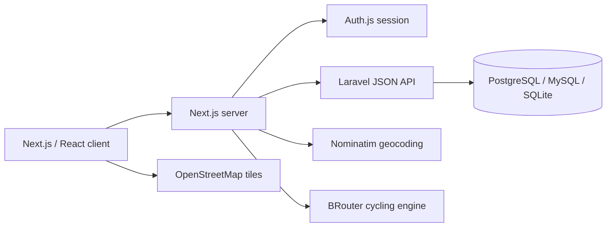
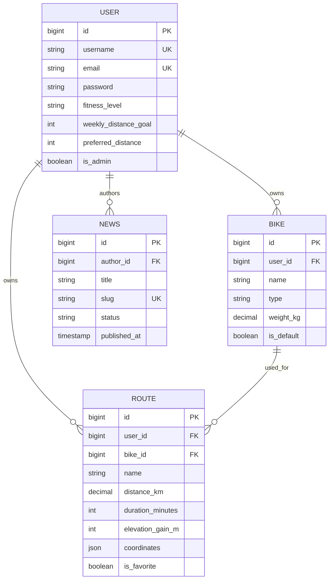

# Architecture

## System overview

The browser never receives the Laravel bearer token directly from application code. Auth.js stores it in the encrypted JWT session, and Server Components, Server Actions, or route handlers make authenticated API calls.

## Domain model

### Ownership guarantees

- A route is always created through `request.user.routes()`.
- Route show, update, and delete operations return `404` when the authenticated user is not the owner.
- A route may only reference a bike owned by the same user.
- Deleting a user cascades to routes, bikes, authored articles, and access tokens.
- Deleting a bike keeps routes but clears the nullable `bike_id`.

## Authentication flow

1. The login form submits username/email and password to the Auth.js credentials provider.
2. Auth.js calls `POST /api/auth/login` on Laravel.
3. Laravel verifies the password and creates a Sanctum token.
4. Auth.js stores user claims and the token in its encrypted JWT cookie.
5. Server-side calls attach the bearer token to Laravel requests.
6. Laravel performs authentication, ownership checks, and administrator authorization.

## Route-planning flow

1. The rider enters start and destination labels.
2. `GET /api/geocode` proxies Nominatim and returns coordinates.
3. `POST /api/route` maps the selected bike profile to a BRouter profile.
4. BRouter returns GeoJSON, track length, time, and climbing.
5. React Leaflet renders the returned coordinates.
6. A Server Action writes the final, user-approved route to Laravel.

External route calculation and persistence are deliberately separate. A failed map-service request cannot create partial route records.

## Authorization

The `auth:sanctum` middleware protects rider endpoints. The custom `admin` middleware is layered on top for administrator endpoints.

Admin safeguards include:

- non-admin users receive `403`;
- admins cannot remove their own admin role;
- admins cannot delete their own account;
- password reset invalidates all existing Sanctum tokens;
- data reset runs inside a database transaction.
